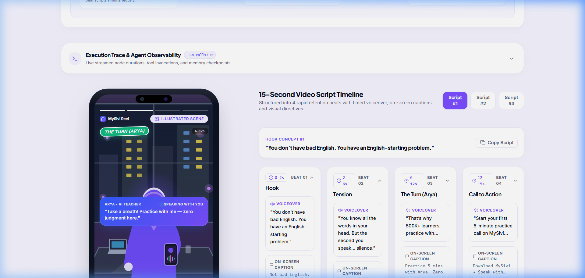
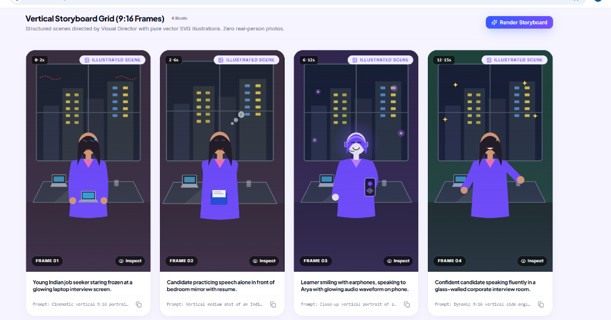
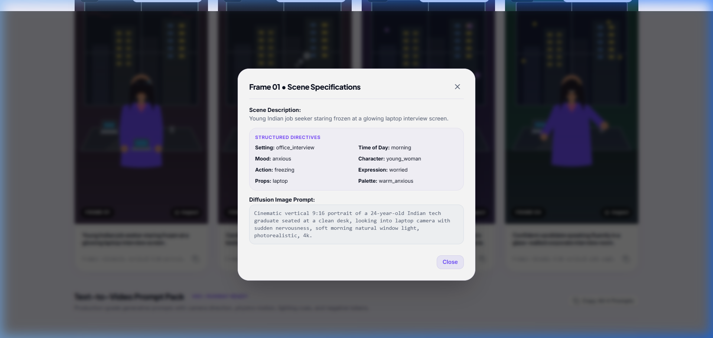
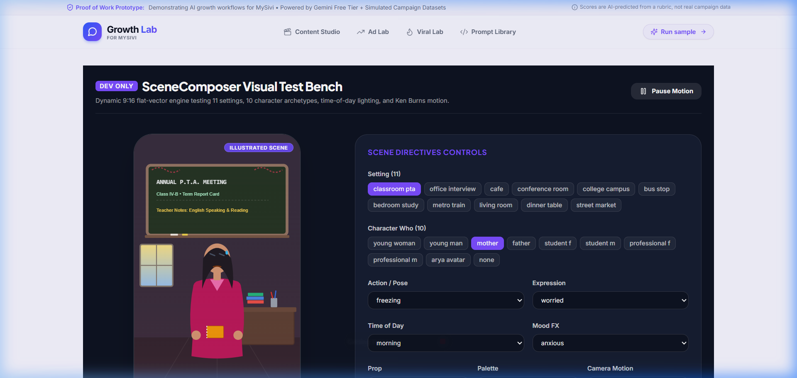
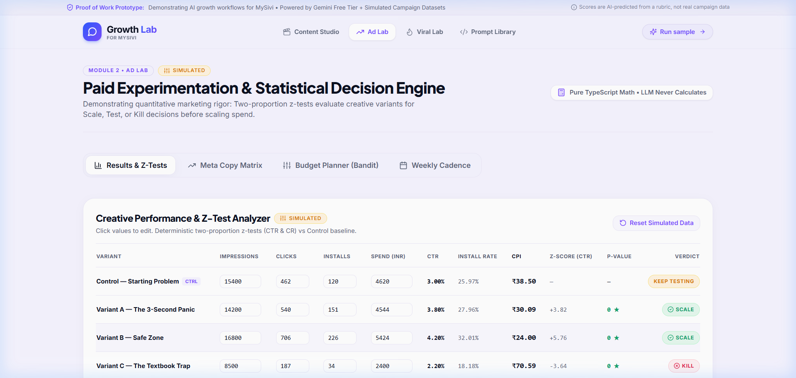
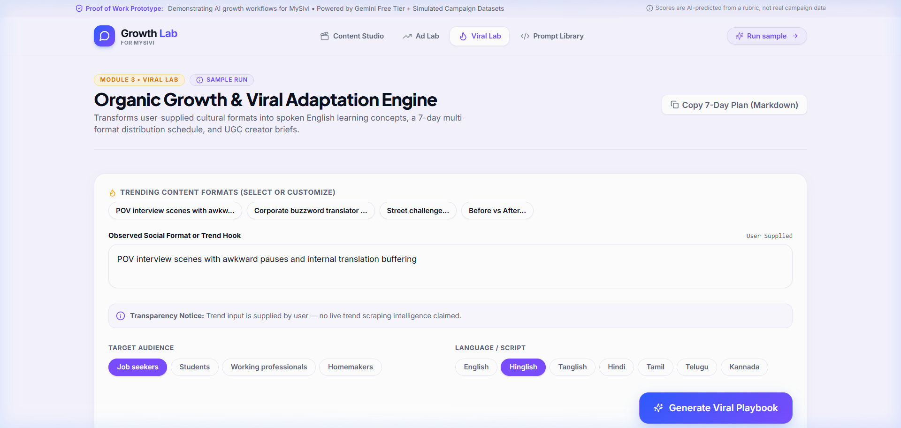

# Growth Lab — Proof of Work for AI Marketing Intern at MySivi

> **"Give me a growth problem and I can use AI, data, and rapid prototyping to turn it into something testable."**

Built by **S K Karishma** ([GitHub](https://github.com/karishma0624) • [LinkedIn](https://www.linkedin.com/in/karishma-sivakumar-25a3a4300/)) as a dedicated hiring demo and proof-of-work for the **AI Marketing Intern** position at **MySivi**.

---

## ⚡ The 30-Second Overview

Growth Lab is an AI growth workspace designed around a single core loop:
$$\text{Learner Problem} \longrightarrow \text{AI Insight} \longrightarrow \text{Content} \longrightarrow \text{Experiment} \longrightarrow \text{Measurement} \longrightarrow \text{Iteration}$$

Rather than a generic dashboard with artificial statistics or superficial wrappers, Growth Lab models an **end-to-end growth operating system** directly aligned with MySivi's product (Arya, the AI English teacher for vernacular speakers in India):

| Job Description Requirement | Growth Lab Module | How It Proves My Competence |
| :--- | :--- | :--- |
| **1. AI agents for content generation (scripts, visuals, videos)** | **Content Studio** | 8-stage agent pipeline (`Strategist` $\to$ `HookWriter` $\to$ `Critic` $\to$ `ComplianceGuard` $\to$ `Ranker` $\to$ `ScriptDirector` $\to$ `VisualDirector` $\to$ `VideoPromptWriter`). Scores 15 hooks across 5 weighted dimensions, isolates the Top 3 with "Real Talk" badges, and renders an animated **ReelPhone** with captions, waveform scrubber, and speech synthesis. |
| **2. Making paid marketing efficient** | **Ad Lab** | Statistical experimentation engine with two-proportion z-tests for CTR and Install Rate ($p < 0.05$). Separates mathematical rigor (TypeScript engine) from qualitative LLM reasoning ("Decision" cards & "What I'd test next"). Includes an Explore / Exploit budget reallocation model. |
| **3. Helping the organic team go viral** | **Viral Lab** | Takes cultural trend formats (e.g. *POV Interview Anxiety*, *Street English vs Corporate English*) and adapts them to MySivi learning arcs, producing a 7-day multi-channel calendar, downloadable Creator Briefs, and a 6-factor heuristic Virality Checklist. |
| **LLM expertise & prompt engineering** | **Prompt Library** | Transparent "Engine Room" displaying the 13 production prompts with system directives, XML `<DATA>` boundary security, JSON Zod schemas, few-shot examples, and design rationale. |

---

## 🎨 Design System & MySivi Aesthetics

Matches the friendly, high-trust educational aesthetic of **[mysivi.ai](https://mysivi.ai)**:
- **Canvas:** Lavender-tinted background (`#F6F4FF`).
- **Cards:** Crisp white containers with `1px #ECE9F8` borders and soft 20px rounded corners.
- **Brand Gradient:** Electric Blue to Vivid Indigo (`#2F5BFF` $\to$ `#7B4DFF`).
- **Typography:** Plus Jakarta Sans (headlines) + Inter (interface) + Noto Sans (vernacular/Hinglish rendering).
- **Signature UI Elements:**
  - **ReelPhone:** 9:16 mobile canvas with Ken Burns motion, beat transitions, auto-scrolling captions, interactive waveform seeking, and optional Indian accent speech synthesis.
  - **Real Talk Stickers:** Highlighting high-relatability learner hooks.
  - **Agent Live Waveforms:** IDLE $\to$ WORKING $\to$ COMPLETE state visualization with real-time output previews.

---

## 🛡️ Honesty as a Product Feature

Every piece of synthetic or simulated data is transparently badged to reflect responsible product and marketing ethics:
- `SAMPLE RUN` — Instant, pre-filled run that works immediately with **zero API keys required**.
- `SIMULATED` — Synthetic ad performance data calculated deterministically to evaluate variant significance.
- `AI-PREDICTED, NOT REAL CAMPAIGN DATA` — Clear demarcation that LLM metrics are heuristic, not actual Meta/Google spend logs.
- `ANIMATED PREVIEW` & `ILLUSTRATED SCENE` — Beautiful custom pure vector SVG scenes rendered by `SceneComposer` (11 settings, 10 character archetypes, time-of-day lighting, mood FX, and Ken Burns motion). 100% free, deterministic, and containing zero real-person or stock photos.
- **Zero Hallucinated Brand Claims:** All figures are tied directly to verified MySivi milestones: **10M+ Downloads**, **15+ Languages**, **4.7★ Play Store Rating**, **500K+ Active Community**.

---

## 📸 Visual Showcase & Zero-Stock Pure Vector Engine

### 1. Dynamic ReelPhone & Illustrated Scenes (100% Free, Zero Stock Photos)

*ReelPhone displaying Beat 1 ("The Interview Freeze") with pure vector SVG background, interactive waveform seeker, word-by-word subtitles, and "Illustrated scene" badge.*

### 2. Vertical Storyboard Grid (4 Beats) & Structured Directives Inspection

*4-Beat Vertical Storyboard Grid showing pure vector SVG illustrations directed by Visual Director with zero real-person photos, structured directives, and prompt inspector.*


*Inspect modal displaying structured directives (Setting, TimeOfDay, Mood, Character, Action, Expression, Props, Palette).*

### 3. Visual Director Test Bench (`/dev/scenes` - Gated in Dev)

*Interactive test bench previewing all 11 settings, 10 character archetypes, time-of-day lighting, and Framer Motion Ken Burns effects.*

### 4. Ad Lab & Viral Lab Distribution Engines
| Ad Lab (Statistical Experimentation Engine) | Viral Lab (7-Day Multi-Channel Planner) |
| :---: | :---: |
|  |  |

---

## 🚀 Quick Start & Local Architecture

### 1. Prerequisites
- Node.js 18+
- npm 9+
- Python 3.11+ (for Agent Mode backend)

### 2. Installation
```bash
git clone https://github.com/karishma0624/mysivi-growth-lab.git
cd mysivi-growth-lab
npm install
```

### 3. Running Modes & Backend Setup

#### A. Frontend UI (Sample Mode & Quick Client)
```bash
npm run dev
```
> [!NOTE]
> Plain `npm run dev` runs Vite SPA on `http://localhost:3000`. In this mode, pre-computed verified sample workflows run with instant zero-cost latency.
> If you want live Quick Mode `/api` serverless routes to run locally, use `npx vercel dev` (plain `npm run dev` returns 404 for `/api/*` endpoints because Vite does not execute Vercel Node serverless functions).

#### B. Serverless `/api` Routes (Quick Mode Live LLM)
```bash
npx vercel dev
```
Runs Vite frontend + Vercel Node.js serverless functions locally on port 3000.

#### C. Agent Mode (FastAPI LangGraph Python Backend)
Agent mode utilizes a multi-agent LangGraph workflow. To run the agent backend:
```bash
cd agent
python -m venv .venv
.\agent\.venv\Scripts\activate  # On Windows, or 'source .venv/bin/activate' on Mac/Linux
pip install -r requirements.txt
uvicorn app.main:app --port 8000 --reload
```
The FastAPI server will be healthy at `http://localhost:8000/healthz`. The frontend automatically connects to port 8000 when Agent Mode is toggled.

#### D. Visual Directives Test Bench (`/dev/scenes`)
During development, navigate to `http://localhost:3000/dev/scenes` to interactively preview all 11 settings, 10 character archetypes, mood FX, and lighting presets.
> [!IMPORTANT]
> The `/dev/scenes` route is gated behind `import.meta.env.DEV` and is completely stripped and excluded from production builds.


---

## 🧪 Quality & Verification Suite

All code adheres to strict TypeScript standards with zero console errors:
```bash
# Type check (strict TypeScript, noUnusedLocals, noUnusedParameters)
npm run typecheck

# Unit tests (Stats, Scoring, Schemas, Sanitization, TTS)
npm run test

# Production build
npm run build
```

---

## 📂 Project Architecture

```
Mysivi/
├── api/                     # Vercel Serverless backend
│   ├── _lib/                # Gemini client, rate-limiting, sanitization, validation
│   ├── studio/              # ideate, evaluate, scripts, media-plan, storyboard
│   ├── ads/                 # generate, explain
│   └── viral/               # plan
├── shared/                  # Shared domain contracts (Type-safe)
│   ├── brandFacts.ts        # MySivi verified ground-truth milestones
│   ├── brandVoice.ts        # Arya persona & brand positioning rules
│   ├── schemas.ts           # Zod validation schemas
│   ├── scoring.ts           # 5-factor weighted scoring algorithm
│   └── prompts/             # 13 isolated prompt definitions
├── src/
│   ├── components/
│   │   ├── home/            # HeroBackdrop, StatRow, ModuleCards
│   │   ├── studio/          # AgentPipeline, HookBoard, ReelPhone, ScriptTimeline
│   │   ├── ads/             # AdMatrix, BudgetPlanner, ResultsTable, VerdictCard
│   │   ├── viral/           # TrendInput, AdaptationCards, CalendarGrid, CreatorBrief
│   │   ├── prompts/         # PromptViewer
│   │   └── ui/              # Button, Card, Badge, Sticker, Waveform, Tabs, etc.
│   ├── lib/
│   │   ├── stats.ts         # Two-proportion z-tests, explore/exploit math
│   │   ├── tts.ts           # Web Speech API audio synthesis
│   │   └── export.ts        # Markdown, JSON, and Prompt export formats
│   ├── data/samples/        # Deterministic sample runs & custom SVG vector scenes
│   └── pages/               # Home, Studio, AdLab, ViralLab, PromptLibrary
└── tests/                   # Vitest automated test suite
```

---

## 👩‍💻 About the Author

Built with focus and passion by **S K Karishma** for the **MySivi AI Marketing Intern** role.
- **GitHub:** [@karishma0624](https://github.com/karishma0624)
- **LinkedIn:** [linkedin.com/in/karishma-sivakumar-25a3a4300](https://www.linkedin.com/in/karishma-sivakumar-25a3a4300/)
